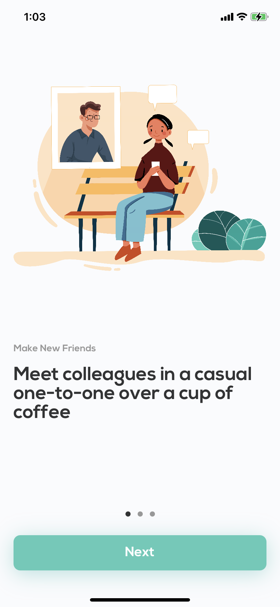
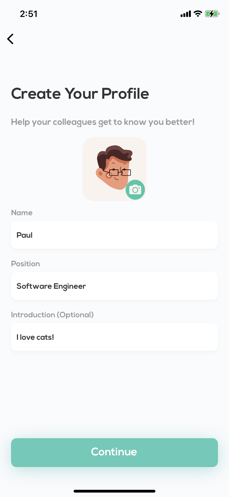
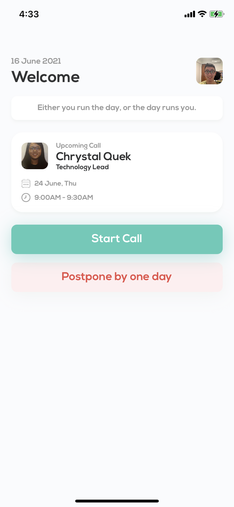
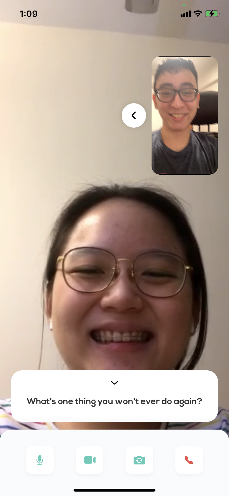

<p align="center"></p>

<h1 align="center">Fika</h1>

<p align="center"></p>

## Overview

With working from home becoming the new normal and more companies encouraging remote hires, it is easy to feel disconnected from not knowing your fellow colleagues on a more personal level. Our daily interactions become more work-driven and we no longer have the luxury of casual chit-chats happening spontaneously in a shared physical workplace.

Fika aims to solve this problem by providing a platform for such one-to-one conversations with random colleagues, even those beyond your department or functional group, as a first step to building lasting connections.

> Fika is the Swedish word for coffee and cake break. But it is more than just that. It is a concept and a state of mind, and an important part of Swedish culture.
>
> It means making time for friends and colleagues to share a cup of coffee (or tea) and a little something to eat. To take a pause in life and socialise. To relax the mind and strengthen relationships.


Fika was built over 3 days for the [CODE_EXP Hackathon 2021](https://codeexp.tk.sg/), which is part of [BrainHack 2021](https://www.dsta.gov.sg/brainhack).

## Team Members

This iOS app was built with love by:

- [Chrystal Quek](https://github.com/chrystalquek)
- [Clara Adora](https://github.com/claraadora)
- [Cao Wenjie](https://github.com/shadowezz)
- [Zhu Hanming](https://github.com/zhuhanming)

## Demo Video

<p align="center"><a href="https://youtu.be/osGCwd6Znd0"></img></a></p>

## Getting Started

To run this application locally, first clone this repository.

```bash
git clone https://github.com/CS-nakes/Fika.git
```

Then, run the following command in the root directory of the cloned repository:

```bash
pod install
```

Finally, open the `Fika.xcworkspace` file to view the project. You will need to change the development team and bundle identifier accordingly to be able to build it locally.

> **Note:** If you're running on a Mac with Apple Silicon, you will be unable to build this project for simulator usage, due to some issues with the required binaries. However, you will still be able to build it for usage on an actual iPhone.

## Sample Screens

<p align="center">&nbsp;&nbsp;&nbsp;&nbsp;&nbsp;&nbsp;</p>

<p align="center">&nbsp;&nbsp;&nbsp;&nbsp;&nbsp;&nbsp;</p>

## Acknowledgements

Huge thanks to the organising team for CODE_EXP and BrainHack 2021! We enjoyed ourselves greatly along the way.

We would also like to thank our mentor Yi Xuan for guiding us along the way.

All assets used in this application were properly licensed via Envato Elements.

<br/>

<p align="center"></p>
